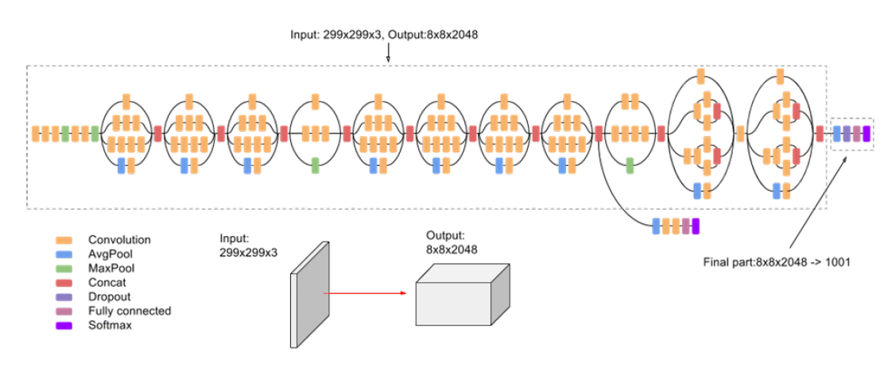

# Brain Tumor Detection

A Brain Cancer is very critical disease which causes deaths of many individuals. The brain tumor detection and classification system is available so that it can be diagnosed at early stages. Cancer classification is the most challenging tasks in clinical diagnosis.The main objective of this project is to predict if the subject has tumor or not, using Deep learning architectures. generally known as NN (Neural Networks) and two transfer learning methods as VGG 19(visual geometric groups) and Inception-V3.Moreover we analyze the structure of each model and compare the experiment based on their accuracy.

## Dataset

There are several datasets available for brain tumor detection, which consist of brain MRI images. The first dataset 1selected contained 98 MRI images without a tumor and 155 images with a tumor. It was believed that the training process would not be time-consuming due to the size of the dataset, allowing for a large number of experiments to be conducted. In fact, a significant number of experiments were carried out, which greatly enhanced my understanding of deep learning architectures and the modifications necessary to improve the accuracy of my results.However, i encountered several issues during the evaluation process, as will be discussed in the following sections.Therefore, the next step was to conduct the same experiments using a larger 2dataset consisting of 1500 MRI images without a tumor and 1500 images with a tumor.

Download dataset [here](https://www.kaggle.com/datasets/navoneel/brain-mri-images-for-brain-tumor-detection)

**Data Augmentation**

Since we had small data set and in order to prevent overfiting we use real time data augmentation to increase our training examples according to kerasblog.We carry out some random rotations and brightness changes.

## CNN model

**layers of thee CNN model**

- Convolution 2D
- Max pooling 2D
- Dropout
- Flatten
- Dense
- Activation

## Transfer learning

Transfer learning is a way to speed up the process of building a deep learning model by using the knowledge from a pre-trained model. It can save time, reduce the amount of training data needed, and lower computational costs. Transfer learning has been used in a variety of fields, such as identifying tumors, predicting software defects, recognizing activities, and classifying sentiments. In this case, the performance of a Deep CNN model we compare to a popular transfer learning approach VGG19 and INCEPTION-V3 presented below.

## VGG19#

## InceptionV3

## Conclusion

In this project, we attempted to build a robust CNN model and find the most accurate transfer learning model using VGG19 and Inception-V3. Initially, we used a small dataset, but all of our models suffered from overfitting. Therefore, we made several scaling changes to the batch size and ultimately determined that a batch size of 32 would not converge in the first epochs, but we achieved better results for 30 epochs. As an optimizer, we selected the Adam optimizer because it can reduce noise in the training process. However, it appears that all of our models continued to overfit. This may have been due to the small size of the validation set in comparison to the training set, causing the models to fit better to the validation set than the training set. Next, we used a larger dataset and implemented the same experiments with the same epochs and hyperparameters. However, we encountered several issues, particularly with the Inception-V3 model, which we had expected to be the most accurate. After conducting extensive research, we discovered that the Imagenet dataset may not include a sufficient number of brain tumor MRI images and may not be able to quickly recognize the subject. Therefore, we did finetuning on Inception-V3 model,use RMS optimizer since he update the learning rate automatically and choose different learning rate for each parameter.Then we retrained the model, which has almost 20 million parameters. Finally, we obtained the results we had hoped for, with more than 99 per cent.We planned to do the same with the VGG19 model, but encountered difficulties with Google Colab and were unable to train the model. However, not every task is said to be perfect in this development field even more improvement may be possible in this application. I have learned so many things and gained a lot of knowledge about development field.
